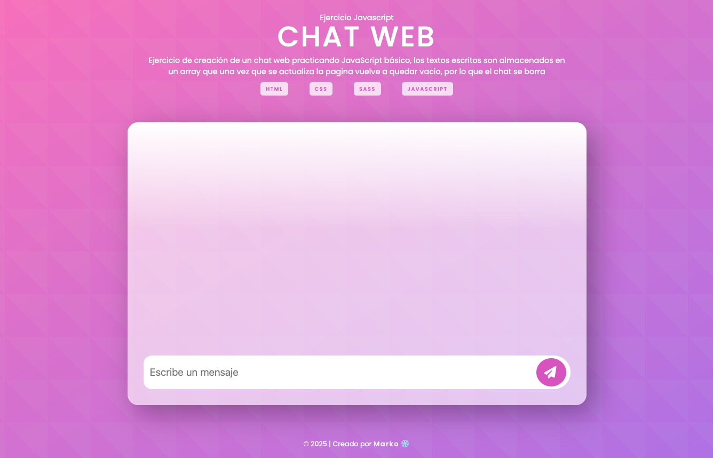

# Chat web

Ejercicio de creación de un chat web practicando JavaScript básico, los textos escritos son almacenados en un array que una vez que se actualiza la pagina vuelve a quedar vacio, por lo que el chat se borra